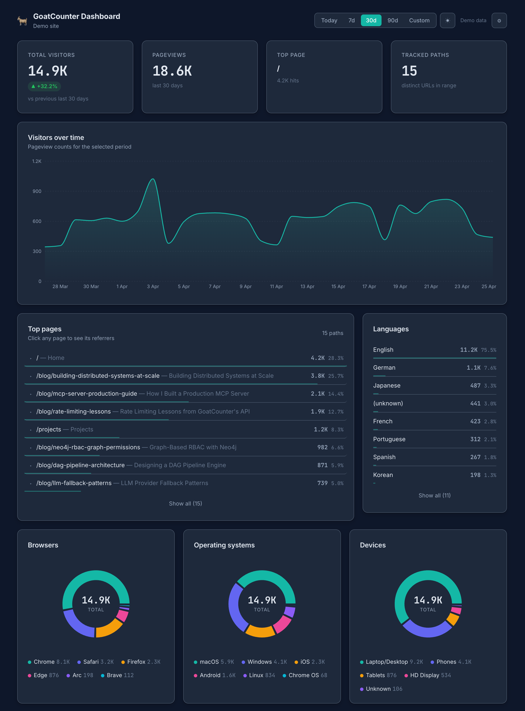

# 🐐 GoatCounter Dashboard

A modern, beautiful, open-source alternative dashboard for [GoatCounter](https://www.goatcounter.com/) analytics. Dark mode by default, interactive charts, fully responsive — and zero servers, zero build step, zero cost. It's a single `index.html` file that you can host anywhere (GitHub Pages, Netlify, your local disk).



## ✨ Features

- 📊 **Interactive charts** — area chart for traffic, donut charts for browsers/OS/devices, horizontal bars for countries and languages.
- 🗺 **Choropleth world map** — countries shaded by visitor count (square-root scale so small markets stay visible), with hover tooltips and a gradient legend.
- 🎬 **Demo mode** — one click on the connect screen loads the full dashboard with realistic sample data. No API key, no account, no setup — useful for trying before connecting and for sharing on social/forums.
- 🌗 **Dark & light mode** — defaults to your system preference, toggle persisted across sessions.
- 📅 **Flexible date ranges** — Today, 7d, 30d, 90d, or a custom range.
- 📈 **Period-over-period trends** — every KPI card compares against the previous equivalent window.
- 🔍 **Drill into pages** — click any page in the Top Pages list to see the referrer breakdown for just that page.
- ⚡ **Smart loading** — KPIs and the traffic chart load first; donut, geo, and campaign breakdowns lazy-fetch only when you scroll to them.
- 💾 **60-second response cache** — switching themes, toggling date ranges, or revisiting a tab within a minute makes zero network requests.
- 🔁 **Per-card retry** — if a card fails (rate limit, hiccup), recover it with a single click instead of refreshing the whole dashboard.
- 🚦 **Rate-limit aware** — strictly sequential request queue with a 500ms gap; never bursts the GoatCounter API.
- 🔄 **Loading indicator** — "Loading X of Y…" while fetching, "Updated Xs ago" when idle.
- 📱 **Fully responsive** — single column on mobile, two-column on tablet, full grid on desktop.
- 🚀 **Zero build step** — single `index.html`, React + Recharts loaded from CDN. Open in a browser and it works.
- 🔒 **Privacy-first** — your API key is stored only in your browser's localStorage. Nothing is sent anywhere except the GoatCounter API directly.
- ♿ **Accessible** — proper ARIA roles, keyboard navigation, focus indicators, and skeleton loading states.

## 🚀 Quick Start

1. Visit **[abhishekhsingh.github.io/goatcounter-dashboard](https://abhishekhsingh.github.io/goatcounter-dashboard)**.
2. Enter your GoatCounter URL (e.g. `https://yoursite.goatcounter.com`) and an API key — or click **Try Demo** to explore with realistic sample data, no account needed.
3. That's it — your dashboard is live.

## 🏠 Self-Hosting

You don't need to trust someone else's hosting. Run your own copy in two minutes:

1. **Fork** this repo (or just download `index.html`).
2. Enable **GitHub Pages** for the repo (Settings → Pages → Source: `main` branch, root).
3. Visit `https://<your-username>.github.io/goatcounter-dashboard`. Done.

Or just drop `index.html` into any static host (Netlify, Cloudflare Pages, S3, your own server) — there's no build step.

### Running locally

```bash
git clone https://github.com/abhishekhsingh/goatcounter-dashboard.git
cd goatcounter-dashboard
# Open directly:
open index.html
# Or serve it with anything that serves static files:
python3 -m http.server 8000
# → visit http://localhost:8000
```

## 🔑 Getting a GoatCounter API Key

1. Log into your GoatCounter site.
2. Click your username (top right) → **Settings** → **API** tab.
3. Click **Create key**.
4. Grant the **Count** and **Read statistics** permissions.
5. Copy the key and paste it into the connect screen.

## 🛠 API Endpoints Used

This dashboard talks to GoatCounter's public REST API (`/api/v0`). Requests are strictly serialized client-side with a 500ms gap between completions so the wire rate (including unavoidable CORS preflights) stays around 2 req/sec — comfortably under GoatCounter's bucket regardless of its exact implementation.

| Endpoint | Purpose | Tier |
|----------|---------|------|
| `GET /api/v0/me` | Verify connection on the connect screen | connect |
| `GET /api/v0/stats/total` | Total-visitors KPI + previous-period total for trend | 1 (immediate) |
| `GET /api/v0/stats/hits` | Traffic time-series + top pages list | 1 (immediate) |
| `GET /api/v0/stats/hits/{path_id}` | Per-page referrer drill-down (on click) | on-demand |
| `GET /api/v0/stats/browsers` | Browser donut chart | 2 (lazy) |
| `GET /api/v0/stats/systems` | OS donut chart | 2 (lazy) |
| `GET /api/v0/stats/sizes` | Device breakdown | 2 (lazy) |
| `GET /api/v0/stats/locations` | Countries chart | 3 (lazy) |
| `GET /api/v0/stats/languages` | Languages chart | 3 (lazy) |
| `GET /api/v0/stats/campaigns` | Campaigns table (when present) | 4 (lazy) |

**Tiering:** Tier 1 fires on initial load. Tiers 2/3/4 lazy-fetch via `IntersectionObserver` when their section enters the viewport, so the initial network burst is just 3 requests regardless of how many breakdowns the dashboard renders.

**Caching:** every successful response is cached in `localStorage` for 60 seconds keyed by `(baseURL, endpoint, params)`. Refresh in the settings menu clears the cache and forces a fresh fetch; Disconnect wipes both the cache and stored credentials.

**Demo mode** bypasses all of the above. The dashboard renders from in-memory sample fixtures — zero requests, zero localStorage writes, zero rate-limit interaction.

## 🧱 Tech Stack

Five scripts loaded from unpkg, in the order the page needs them:

- **React 18** + **ReactDOM 18** (UMD)
- **prop-types 15** (UMD) — required at runtime by Recharts' UMD build. Recharts treats `PropTypes` as an external global; without this script tag the chart layer crashes during init.
- **Recharts 2** — area chart for traffic, donut charts for browsers/OS/devices, horizontal bar lists for countries and languages
- **Babel Standalone** — in-browser JSX compilation

Plus:

- **Inter** + **JetBrains Mono** from Google Fonts
- Plain CSS with custom properties for theming — no Tailwind, no preprocessor, no bundler
- One generated static asset: `assets/world-map.js` — country path data for the choropleth, regenerated only when the underlying dataset changes via `scripts/build-world-map.js`

The dashboard itself is a single `index.html`. No runtime build step.

## 🧭 Project Status

Working today:

- ✅ Connect / disconnect with persisted credentials
- ✅ Demo mode with realistic sample data (no account needed)
- ✅ All 9 GoatCounter stat endpoints integrated
- ✅ Period-over-period trend on the visitors KPI
- ✅ Drill-down referrers per page (click any row in Top Pages)
- ✅ Choropleth world map with hover tooltips (sqrt color scale)
- ✅ Dark / light theme with system-preference default
- ✅ Today / 7d / 30d / 90d / Custom date ranges
- ✅ Strict-sequential rate-limited request queue
- ✅ 60-second `localStorage` response cache
- ✅ Lazy-loaded breakdowns via `IntersectionObserver`
- ✅ Per-card retry button on failed endpoints
- ✅ "Loading X of Y…" / "Updated Xs ago" freshness indicator
- ✅ Skeleton loading states, fault-tolerant error handling

Ideas for the future: CSV export, multi-site switcher, real-time mode, stale-while-revalidate cache.

## 🤝 Contributing

PRs welcome! For most changes the flow is:

1. Fork & clone.
2. Edit `index.html`.
3. Open it in a browser to test.
4. Open a PR.

The only piece of the repo that needs Node is `scripts/`, which regenerates `assets/world-map.js` from pinned source data. You only run it when the country dataset itself needs updating — see [`scripts/README.md`](scripts/README.md) for the recipe. Touching the dashboard never requires it.

### Project rules

These keep the dashboard simple and trustworthy. PRs that violate them are unlikely to be merged:

- **No runtime build step.** The dashboard runs in the browser as-is. The single static asset that's "built" — `assets/world-map.js` — is regenerated only when the underlying country dataset needs updating, via `scripts/build-world-map.js`. Routine code changes don't need npm. The dashboard itself never sees Node.
- **No new runtime dependencies** beyond the five already loaded from a CDN (React, ReactDOM, prop-types, Recharts, Babel-standalone). `prop-types` looks unused if you grep the source, but Recharts' UMD build calls it during module init — removing the script tag silently breaks all charts. Adding another script tag needs a strong reason and an issue to discuss it first.
- **No analytics, telemetry, or tracking.** This is a privacy-friendly dashboard for a privacy-friendly analytics tool — it cannot phone home. The only network calls allowed are to the user's GoatCounter instance.
- **No backend.** No server-side proxy, no serverless function, no edge worker. Everything must run in the browser against the GoatCounter API directly.
- **Credentials stay local.** API keys live in `localStorage` and only travel to the user's GoatCounter site over HTTPS. Never log them, never send them anywhere else.
- **Keep it deployable to GitHub Pages.** Anything that breaks plain static hosting (relative paths, framework conventions, etc.) is out of scope.
- **Match the existing style.** Plain CSS with custom properties, no Tailwind / styled-components / CSS-in-JS. React function components with hooks. No class components.

Bug reports and feature ideas → [GitHub Issues](https://github.com/abhishekhsingh/goatcounter-dashboard/issues).

## 🔧 Troubleshooting

Having issues connecting? See the [Troubleshooting Guide](TROUBLESHOOTING.md).

## 📄 License

MIT — see [LICENSE](LICENSE).

## 👤 Author

**Abhishekh Singh**
- Portfolio: [abhishekhsingh.github.io](https://abhishekhsingh.github.io)
- GitHub: [@abhishekhsingh](https://github.com/abhishekhsingh)

GoatCounter itself is built by [Martin Tournoij](https://github.com/arp242) and is wonderful — go [support the project](https://www.goatcounter.com/) if you find it useful.
